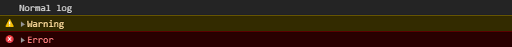
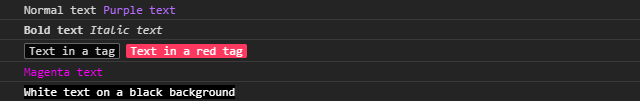

# Wonderlog - simple and customizable browser console styling

## About

Wonderlog is a small library that aims to make styling console logs accessible.

Browsers have supported applying styles to logs with the `%c` modifier for a while now, but it's too confusing and annoying to use.

Wonderlog is inspired by [Chalk](https://github.com/chalk/chalk), but designed for use with browser consoles instead of the terminal.

## Highlights

- easy to use, intuitive interface
- fully customizable
- useful predefined styles included
- dependency-free
- typescript support

## Installation

```console
npm install wonderlog-console
```

# Basic usage

```js
import { wonder } from "wonderlog-console";

// 👇 Support for all the basic console logging functions
wonder.log("Normal log");
wonder.warn("Warning");
wonder.error("Error");
// + group, groupCollapsed, groupEnd, debug
```



### Using styles

```js
// ✨ Apply styles using the predefined properties
wonder.log("Normal text", wonder.purple("Purple text"));
wonder.log(wonder.bold("Bold text"), wonder.italic("Italic text"));
wonder.log(wonder.tag("Text in a tag"), wonder.dangerTag("Text in a red tag"));

// ...or use custom values!
wonder.log(wonder.color("#FF00FF")("Magenta text"));
wonder.log(wonder.bg("black").white("White text on a black background"));
```



### Nesting styles

```js
// Styles can be nested and chained intuitively 🎒
wonder.log(wonder.red("Red text", wonder.bold("Bold red text", wonder.blue("Bold blue text")))));

// If styles set the same property, only the last style is used
wonder.log(wonder.red.green.blue("Blue text"));
```

### Saving presets

```js
// Styles can be saved and reused easily
const success = wonder.green.pre("✅");
const failure = wonder.red.pre("❌");

wonder.log("Styling", success("successful"), "iritation", failure("not found"));
```


# Advanced usage

## Formatting data

By default, wonder passes data to the console directly, regardless of its type:

```js
wonder.log(["this", "array", "has", 5, "elements"]);
// Results in: console.log(["this", "array", "has", 5, "elements"])
wonder.log({ exampleProperty: "example property value" });
// Results in: console.log({ exampleProperty: "example property value" })
```

However, if you apply any styles to the data, it will have to be converted into strings so that it can be styled in the console.

By default wonder uses `toString()` to get the displayed value, but you can override this behaviour using formatters:

```js
// Default behaviour
wonder.log(wonder.red({ exampleProperty: "example property value" }));
// 📢 [object Object]

// Converting objects to JSON 🎈
wonder.log(
  wonder.red.formatObjectAsJson({ exampleProperty: "example property value" })
);
// 📢 {"exampleProperty":"example property value"}
wonder.log(
  wonder.red.formatObjectAsMultilineJson({
    exampleProperty: "example property value",
  })
);
```

### Other formatters

```js
wonder("one", "two", "three");
// 📢 one two three
wonder.formatStringAsLiteral("one", "two", "three");
// 📢 "one" "two" "three"

wonder(1234567.890123);
// 📢 1234567.890123
wonder.formatNumberAsLiteral(1234567.890123);
wonder.formatNumberAs(new Intl.NumberFormat("en-US"))(1234567.890123);
// 📢 1,234,567.89  💡 uses `Intl.NumberFormat("en-US")` by default

wonder(["one", "two", 3.0]);
// 📢 one,two,3  💡 just like ["one", "two", 3.0].toString()
wonder.formatArrayAsIndividualItems(["one", "two", 3.0]);
// 📢 [one, two, 3]
wonder.formatArrayAsIndividualItems.formatStringAsLiteral(["one", "two", 3.0]);
// 📢 ["one", "two", 3]
```

### Note - browser limitation

Unfortunately browsers don't support interweaving styled string and objects within a single console.log.

However, it is possible to get both in a single line, by logging any objects after the styled content:

```js
// This might give unexpected results
wonder.log("Text", { foo: "bar" }, wonder.red("red text"));
// 📢 Text [object Object] red text

// But this should work correctly
wonder.log("Text", wonder.red("red text"), { foo: "bar" });
// 📢 Text red text {foo: "bar"}
```

💡 This is not a limitation of `wonderlog`, but a result of how applying styles in the browser console works.

## Showing correct line numbers

You can configure your developer tools to show the correct line numbers by **blackboxing** the `WonderImplementation.js` file.

[See chrome devTools docs](https://developers.google.com/web/tools/chrome-devtools/javascript/reference#blackbox)

## Feedback

If you have any feedback or suggestions for this package, feel free to open an issue on [Github](https://github.com/grekomp/wonderlog).
